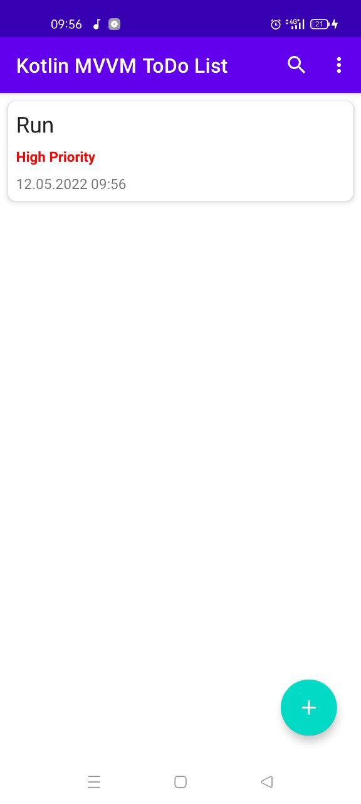
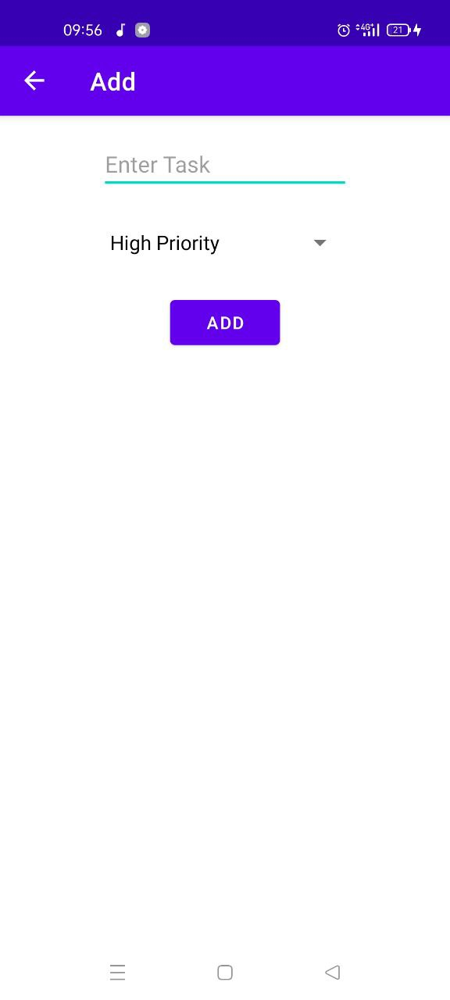

# ToDoList

## Project requirements
1. Maximum one page description of the project, main features
2. Usage of network requests using Retrofit2
3. Usage of local database using Room
4. Usage of dependency injection
5. Well designed architecture MVP or MVVM
6. All features described in step 1 must be finished and tested. Without any
crashes and bugs.
7. GitHub repo with well described Readme.md

---

## Description of the project, main features

In the ToDoList application, I can add, remove, update, find each task using a search engine, and sort by high priority.

+ MVVM architecture
+ Room database
+ Retrofit
+ Navigation
+ ViewModel

---
## Screenshots

### Main_screen

### Add_screen

